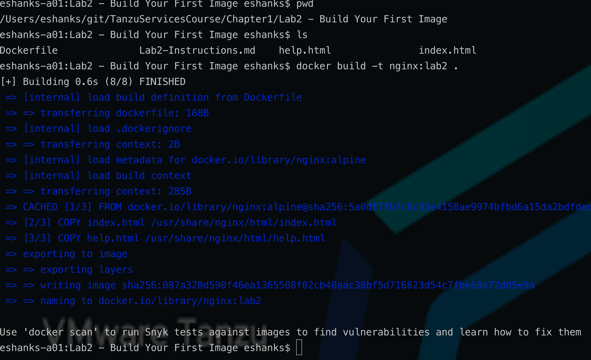
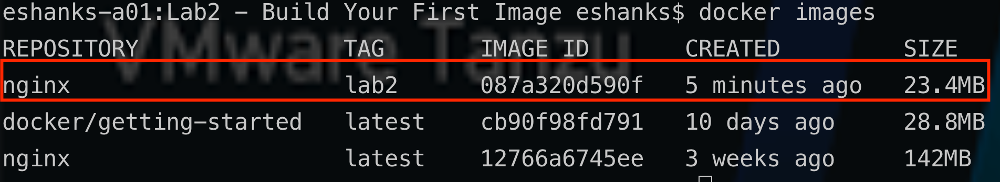
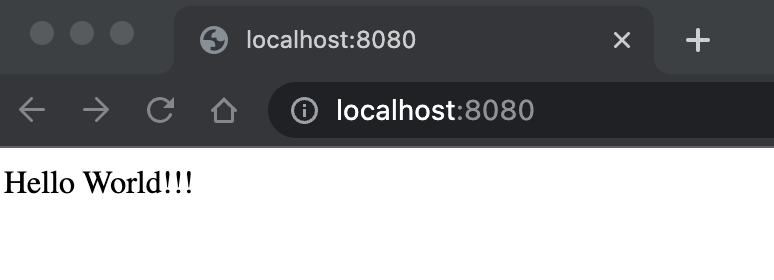
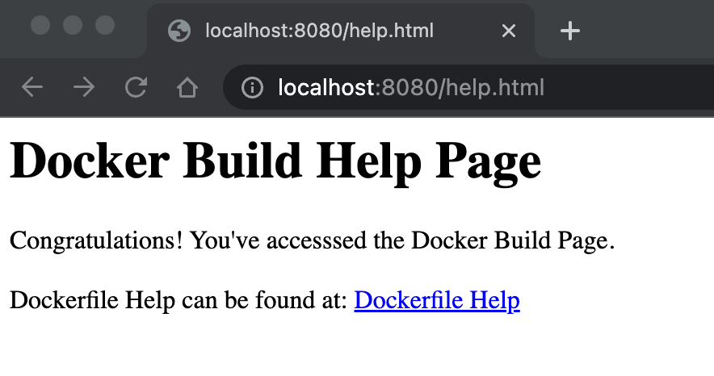
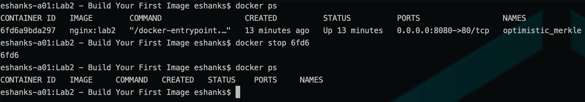

# Lab 2 - Build Your First Container Image

## Introduction

In this lab, you will build your own container image based on nginx and will run this image on your local workstation. This lab uses a pre-built Dockerfile and two HTML files, both of which are found in this [Lab Folder](./).

A dockerfile creates a customized docker image that can be deployed time after time. This is the big differentiation between containers and VMs.  To modify a VM you can patch/update it, to modify a container you have to rebuild it. 

### Step 1 - Review the Pre-Build Dockerfile

Open the Dockerfile to review how the contianer image is being built.

Test your understanding:

- What is the base layer?

- What port will the container be available on?

- Is there any way to re-write this Dockerfile to reduce the number of layers it contains?

### Step 2 - Build a new Docker Image

Use the Dockerfile to build a new container image named `nginx:lab2`

> Be sure to change to the Chapter 1 Build your first image working directory.

```bash
docker build -t nginx:lab2 .
```





### - Step 3 - Run a Container from the Image

Run a new container from the local image that was just built.

```bash
docker run -d -p 8080:80 nginx:lab2
```

- Can you access the container through a web browser?

- Which port do you use to access the container on your local machine?

### - Step 4 - Access the Application Through a Browser

If your container is running, you should be able to access it here: [http://localhost:8080](http://localhost:8080)



This build also created a help page which gives us a link to the Docker Build help page online.

[http://localhost:8080/help.html](http://localhost:8080/help.html)



### - Step 5 - Stop the Running Container (Review)

Locate the containerID of the running container.

```bash
docker ps
```

```bash
docker stop [CONTAINER_ID]
```




