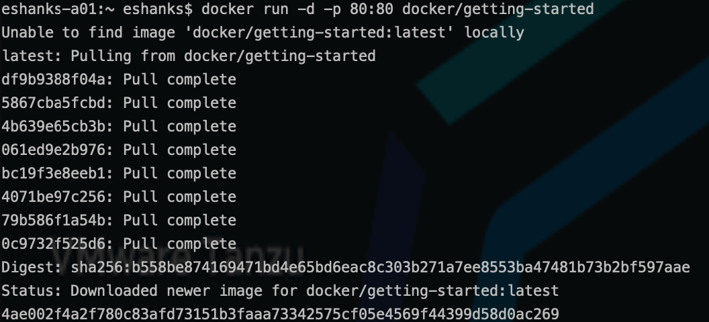
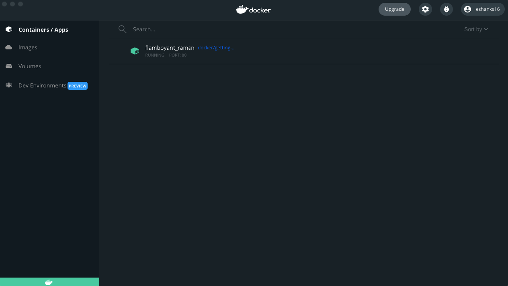
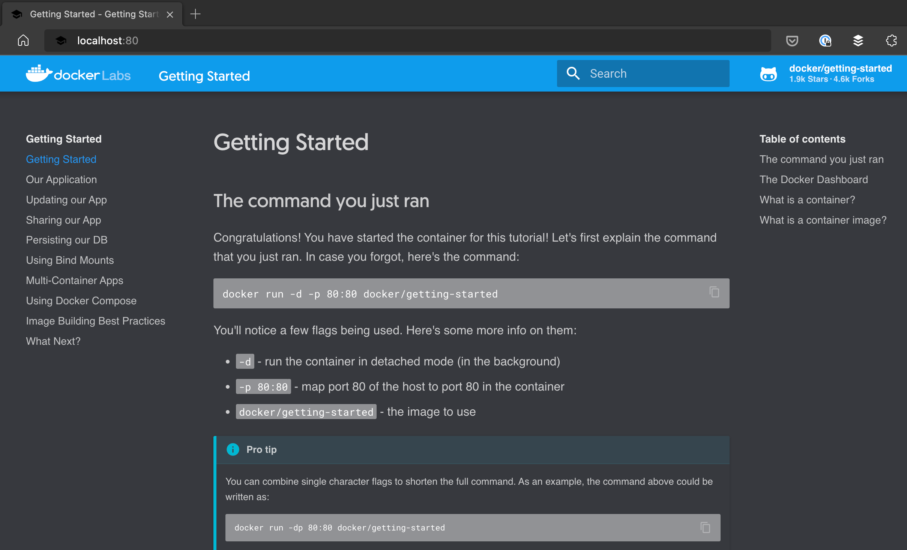
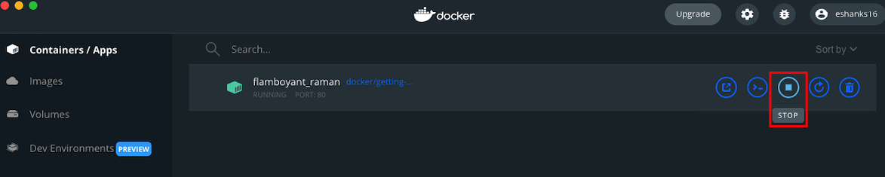
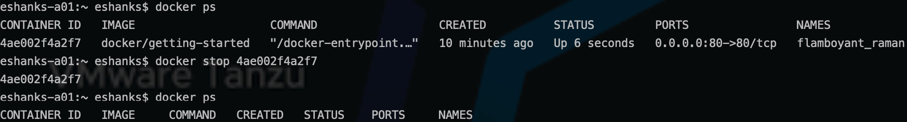

# Lab 1 - Run Your First Container

## Introduction

In this lab, you will install docker desktop onto your workstation and run your first container.

### Step 1 - Install Docker Desktop

Go to the [Docker Desktop Download](https://docs.docker.com/desktop/) page for instructions on installing Docker Desktop for your workstation's operating system.

>Note: Docker Desktop is free for small businesses, personal use, education, and non-commercial open source projects. See https://www.docker.com/blog/updating-product-subscriptions/ for more information.

### Step 2 - Run the Getting Started Contianer

Run the getting started application as explained in the Docker Desktop UI. Open a terminal window and run the following command:

```bash
docker run -d -p 80:80 docker/getting-started
```

>Note:

```text
-d = detached mode
-p = port mapping [host port]:[contianer port]
docker/ = docker registry
getting-started = container name
```



### Step 3 -  View the Running Container

View the docker desktop UI to see a running container. 
What is the name of your container? When creating this demo, the container name was `flamboyant_ramen`. 



After viewing the container in docker desktop, open up a web browser and access the container's web URL on your localmachine. The command used above assigned the port to port 80. To access the URL go to http://localhost:80

You should see the web page of the running container on your local workstation.



### Step 4 - Stop the Running Container

Stop the container in one of two ways.

1. Through the Docker Desktop GUI

Hover over the running container and click the `STOP` icon to stop the contianer from running. 



2. Through the docker cli

From your terminal window run the following command to list all running contianers:

```bash
docker ps
```



From the list of results copy the `CONTAINER ID` of the contianer you wish to stop.

To stop the running container, run:

``` bash
docker stop <CONTAINER_ID_HERE>
```
