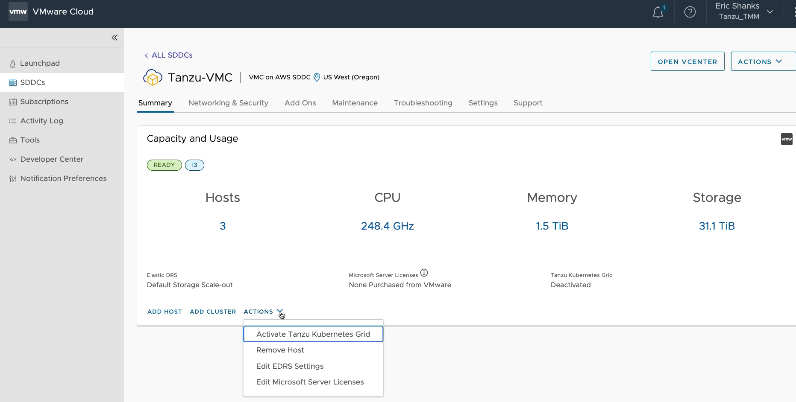
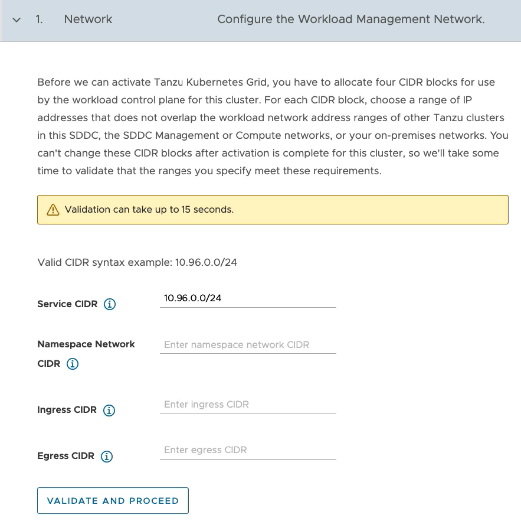
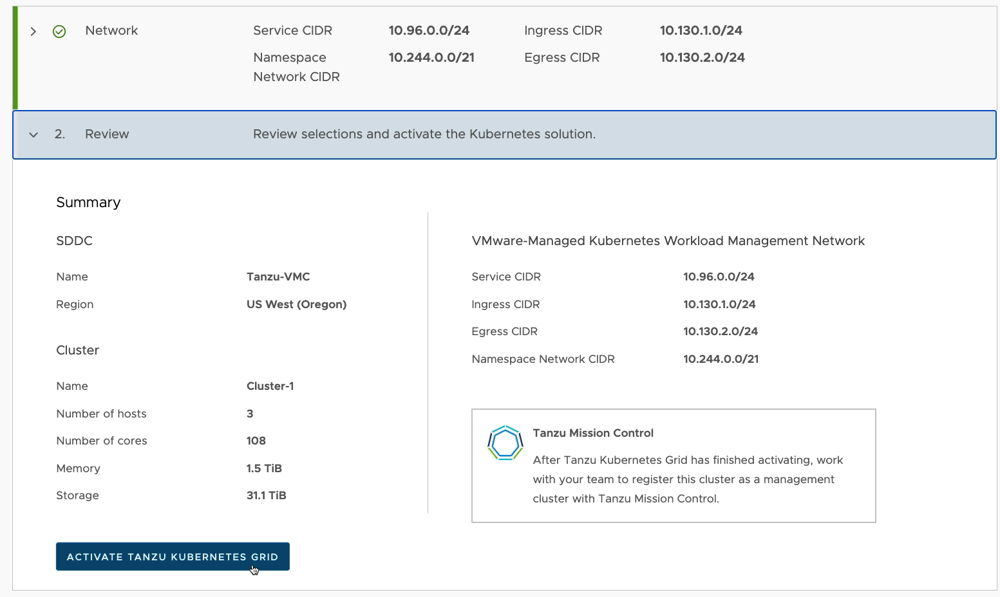
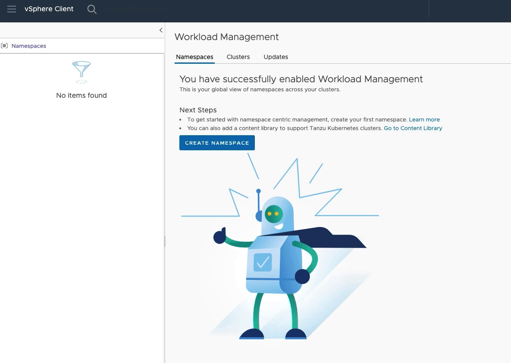

# Lab 3 - Activate the TKG Service

## Introduction

In this lab, you will activate the Tanzu Kubernetes Grid Service in your own VMware Cloud on AWS SDDC.

### Step 1 - Select the SDDC to Activate TKG

From your VMware Cloud on AWS Console, determine which SDDC will run the Tanzu Kubernetes Grid Service. This SDDC should have a minimum of three nodes in a single availability zone, and it must have enough free resources to run the Tanzu Supervisor Cluster.

> Note: You can repeat this process on additional SDDCs if you choose to do so.

From the actions drop down, select `Activate Tanzu Kubernetes Grid`.

### Step 2 - Enter CIDR addresses

Enter four CIDR ranges that do not overlap with any of your existing corporate networks.

- `Service CIDR`
- `Namespace Network CIDR`
- `Ingress CIDR`
- `Egress CIDR`

Click `Validate and Proceed`

### Step 3 - Review the Configuration Settings

Review the configuration settings and ensure the CIDR addresses have been entered correctly from the previous page.

Click the `Activate Tanzu Kubernetes Grid` button.

### Step 4 - Wait

Creating the software defined networking and the TKG Supervisor cluster takes roughly 20 minutes to complete.

### Step 5 - Verify TKG Activation was successful

Once TKG Activation is complete, login to your VMware Cloud on AWS vCenter instance and
check Workload Management to ensure activation was successful.

From the vCenter console select the `Workload Management` screen from the navigation.

