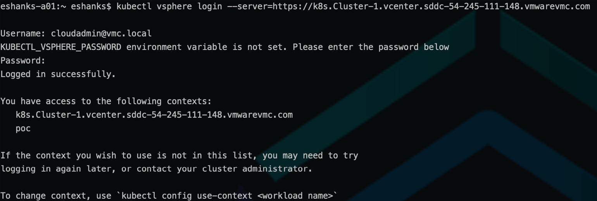

# Lab 7 - Authenticate to the TKG Service

## Introduction

In this lab, you will use the kubectl vsphere plugin to create a KUBECONFIG file that can be used to authenticate with the Tanzu Kubernetes Grid Service.

### Step 1 - Obtain the Kubernetes Control Plane Endpoint URL

From the vCenter console, navigate to the `poc` namespace created in previous labs and open the link to the Kubernetes Control Plane Endpoint.

]

Copy the URL from the Kubernetes Control Plane Endpoint.

### Step 2 - Login

From the command line, run the following command and replace the [Kubernetes Control Plane Endpoint] value with the URL you copied from Step 1.

``` bash
kubectl vsphere login --server=[Kuberntes Control Plane Endpoint]
```

1. Enter a user who has permissions to this namespace
2. Supply the SSO password for this user



>Note: You do not need to use the `cloudadmin` account but it should be a user or group that you've assigned permissions to the `poc` namespace during the [vSphere Namespace Setup Lab](/Chapter3/Create%20a%20vSphere%20Namespace/Instructions.md).
