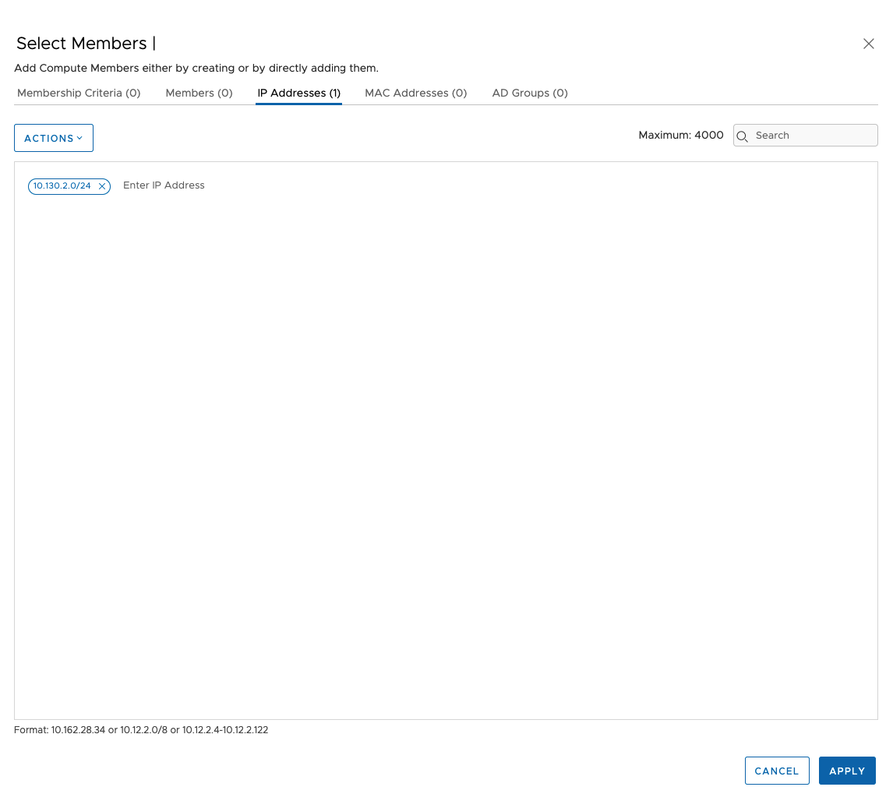
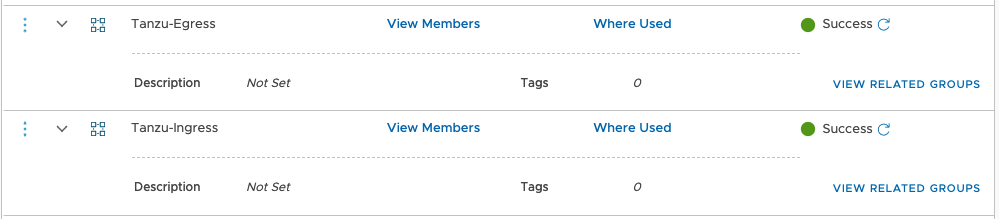
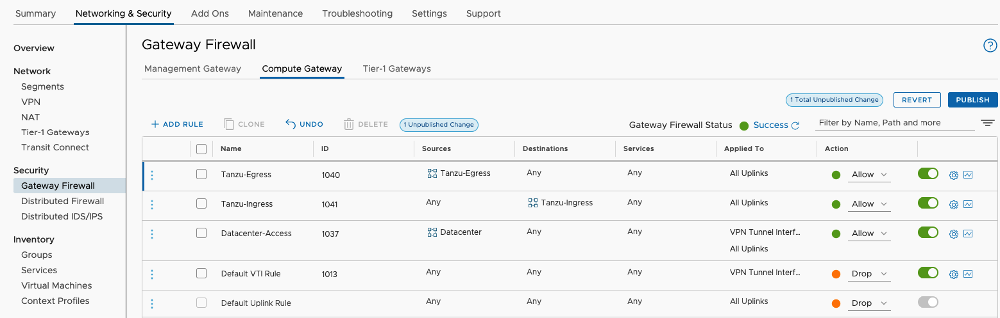

# Lab 5 - Create Firewall Rules

## Introduction

In this lab, you will create firewall rules to allow access to/from your Tanzu Kubernetes Cluster environment.

### Step 1 - Create Firewall Groups

From the VMware Cloud SDDC in which Tanzu services has been activated, navigate to the `Groups` menu in the `Network & Security` tab.

Under `Compute Groups` click the `ADD GROUP` button.

Name the group: `Tanzu-Egress` and then click `Set Members`. In the `IP Addresses` section, add your Egress CIDR range used during activation of the TKG Service and click `Apply`.

Repeat this process again for your Ingress Addresses. Name the group `Tanzu-Ingress` and set the members to the Ingress CIDR range used during activation of the TKG Service.

### Step 2 - Create Egress Firewall Rule

> NOTE: !!!! Discuss opening firewall rules for your environment with your network security team. !!!

From the `Gateway Firewall` menu of the `Network & Security` tab, select the `Compute Gateway` subtab. Click `+ADD RULE` link to add a new firewall rule.

Create a Firewall rule named `Tanzu-Egress` with the following properties:

- Source: `Tanzu-Egress` group
- Destination: `ANY`
- Service: `ANY`
- Applied Uplinks: `ALL UPLINKS`
- Action: `Allow`

### Step 3 - Create Ingress Firewall Rule

> NOTE: !!!! Discuss opening firewall rules for your environment with your network security team. !!!

From the `Gateway Firewall` menu of the `Network & Security` tab, select the `Compute Gateway` subtab. Click `+ADD RULE` link to add a new firewall rule.

Create a Firewall rule named `Tanzu-Ingress` with the following properties:

- Source: `ANY`
- Destination: `Tanzu-Ingress` group
- Service: `ANY`
- Applied Uplinks: `ALL UPLINKS`
- Action: `Allow`

### Review and Publish Rules

Review your firewall rules carefully and ensure you won't break any corporate rules.

Click the `Publish` button.

