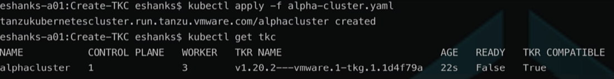
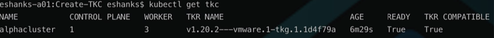
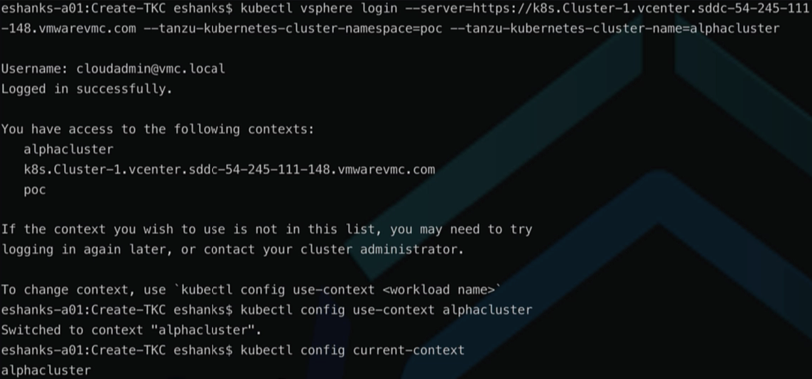
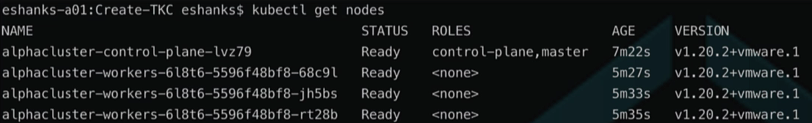

# Lab 8 - Create a Tanzu Kubernetes Cluster

## Introduction

In this lab, you will use the TKG Managed Service to deploy a Tanzu Kubernetes Cluster from a YAML manifest and apply it with the `kubectl` command line utility.

### Step 1 - Authenticate to the TKG Service

The Authentication token stored in your local KUBECONFIG file expires every 10 hours. You will want to re-authenticate to the TKG Service before starting the lab to ensure you have access to the Supervisor cluster.

Run:

``` bash
kubectl vsphere login --server=[vSphere Control Plane Endpoint] --tanzu-kubernetes-cluster-namespace=poc
```

After successful authentication, change your Kubernetes context to the POC namespace by running:

``` bash
kubectl config use-context poc
```

>Note: See the [Authenticate](../Authenticate%20to%20TKG/Instructions.md) lab for a more detailed refresher on the procedures.

### Step 2 - Build a TKC Manifest

Start with the [alpha-cluster](alpha-cluster.yaml) YAML template provided in this GIT repository. Save the YAML file to your local workstation and prepare to edit the contents for your environment.

``` yaml
apiVersion: run.tanzu.vmware.com/v1alpha2
kind: TanzuKubernetesCluster
metadata:
  name: alphacluster
  namespace: poc
spec:
  topology:
    controlPlane:
      replicas: 1 #optional change to 3 for HA control plane
      storageClass: [choose from `kubectl get sc` command]
      tkr:
        reference:
          name: [choose from `kubectl get tkr` command]
      vmClass: [choose from `kubectl get vmclass` command]
    nodePools:
    - name: workers
      replicas: 3 #choose at least 1 node
      storageClass: [choose from `kubectl get sc` command]
      vmClass: [choose from `kubectl get vmclass` command]
```

Update the YAML manifest with the options applicable to your VMware Cloud on AWS environment.

1. Update the `storageClass` keys with a storage class from your VMC environment. Available Storage classes can be found with the command:

``` bash
kubectl get storageclass
```

2. Update the `tkr.reference.name` field with a Tanzu Kubernetes Release (TKR) matching your VMC environment. Available TKRs can be found by running the following command:

``` bash
kubectl get tkr
```

3. Update the `vmClass` field with virtual machine classes you've allowed for your poc namespace. You can list the available classes by running:

``` bash
kubectl get vmclass
```

> Note: these VM classes affect the size of the cluster's VMs that will be deployed.

4. `Optional` - Modify the number of control plane or worker node replicas.

The default template deploys a Single Control Plane node (not Highly Available) and three worker nodes. You may modify the control plane to use 3 nodes if you wish to have a highly available control plane.

5. After modifying the YAML template, save the file.

### Step 3 - Apply the Tanzu Kubernetes Cluster Manifest

From your terminal run the following command to send the cluster build request to the Supervisor Service:

``` bash
kubectl apply -f alpha-cluster.yaml
```



After applying the YAML Manifest it will take several minutes to complete the deployment and configuration of the Tanzu Kubernetes Cluster.

You can run the following command to check the status of your Kubernetes Cluster:

``` bash
kubectl get cluster alphacluster
```

When the status shows `Ready` you can move on to the next step.



### Step 4 - Login to the Alphacluster

Once the cluster has been provisioned, re-authenticate to the TKG Supervisor Service to get a new cluster context in your KUBECONFIG file.

Run the following login command to update the KUBECONFIG file:

``` bash
kubectl vsphere login --server=[vSphere Control Plane Endpoint] --tanzu-kubernetes-cluster-namespace=poc --tanzu-kubernetes-cluster-name=alphacluster
```

Supply your Username/Password at the prompts.

After successfully authenticating, change your context to the alphacluster by running:

``` bash
kubectl config use-context alphacluster
```



### Step 5 - Run a Kubernetes Command

To test your connection to the new Tanzu Kubernetes cluster, run a kubectl command to test access to the API server for that TKC.

The command below will display the nodes part of this Kubernetes cluster.

``` bash
kubectl get nodes
```

