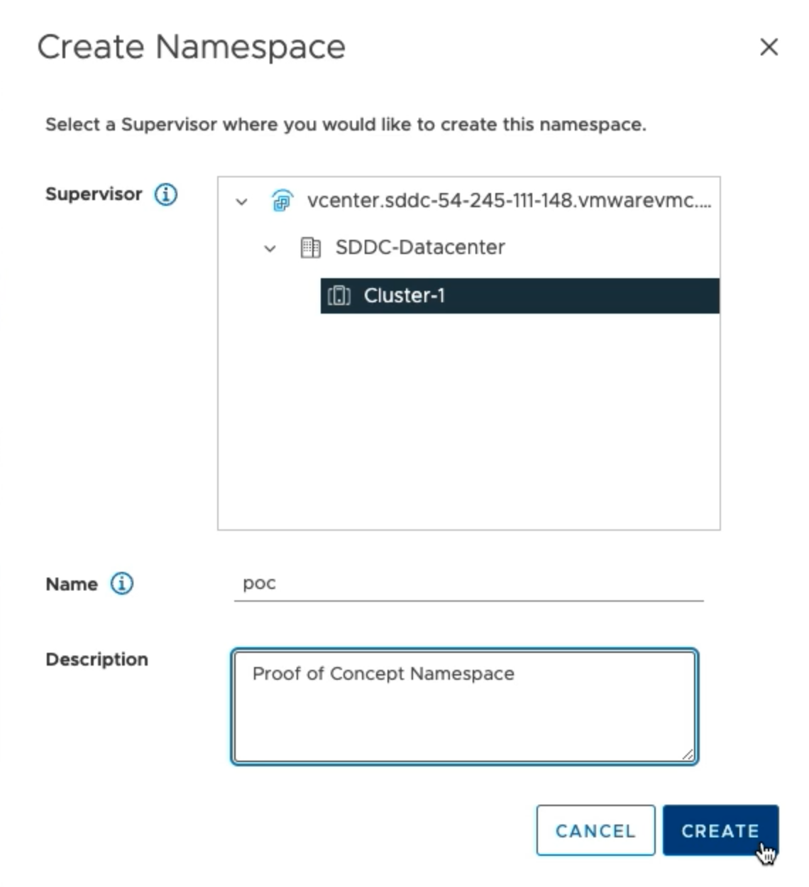
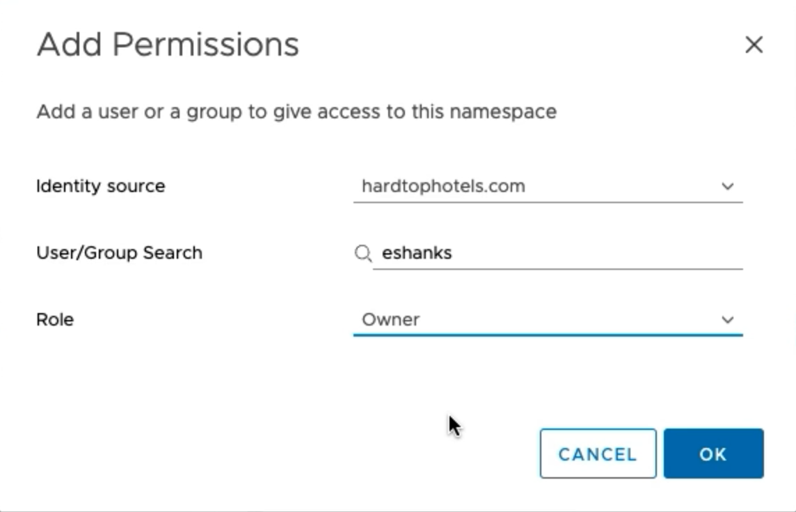
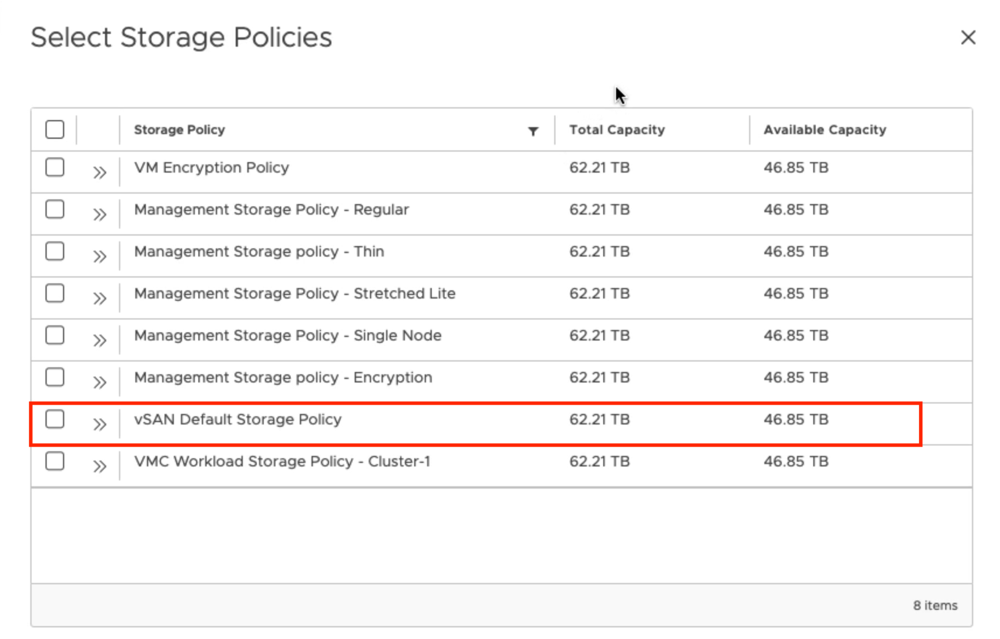

# Lab 4 - Create a vSphere Namespace

## Introduction

In this lab, you will create a vSphere Namespace and assign resources to a group of users.

### Step 1 - Create the Namespace

From the vCenter console select the `Workload Management` screen from the navigation.

Click the `Create Namespace Button`.

Enter `poc` for the namespace name and optionally enter a description.

>NOTE: Namespace name must be lower case.

Click the `Create` button to complete the namespace creation.

### Step 2 - Assign Users to the Namespace

>Note: This step assumes you have already added an identity source such as Active Directory to your vCenter Single Sign-On.

In the permissions tile of your `poc` namespace, click the `ADD PERMISSIONS` button.

Select your own identity source from the drop down and search for the users or groups that you want to assign permissions to this namespace.

In the Role field, select `Owner`.

### Step 3 - Add a Storage Policy to the Namespace

In the Storage tile of the `poc` namespace click the `ADD STORAGE` button.

Select the `vSAN Default Storage Policy`, then click `OK`.

### Step 4 - Add Resource Limits (Optional)

You may click the `Edit Limits` link in the `Capacity and Usage` tile to restrict what resources your users will be able to use. This is a good way to ensure your Kubernetes clusters won't be stealing resources from your virtual machines or other running workloads.

You can optionally add resource limits to CPU, Memory, total storage, or individual storage policies to meet your needs.

### Step 5 - Add VM Classes

In the `VM Service` tile select `best-effort-medium` from the list at a minimum. You
may select as many of the VM Classes that you'd like to be available for your users.
The best-effort-medium class will be used for future labs.

Click `OK`.

### Extra - Create a Second vSphere Namespace

Can you create a second vSphere Namespace in your workload management screen and configure
it for a second team?

Test your Understanding:

- Why would you use a second vSphere namespace?
- How would you organize your namespaces for multiple teams?
- Could namespaces be used to separate environments instead of teams?
