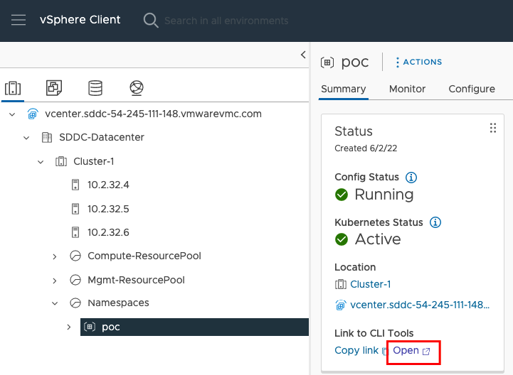
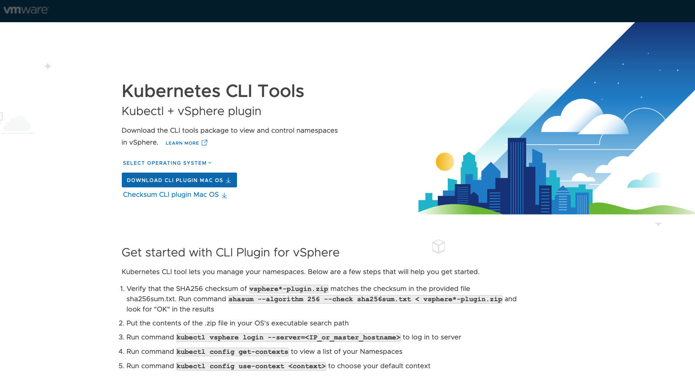
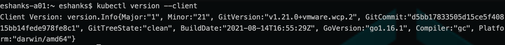
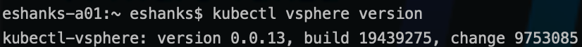

# Lab 6 - Install CLI Tools

## Introduction

In this lab, you will download and install the CLI tools needed to interact with a Kubernetes cluster and vSphere.

### Step 1 - Download the CLI Tools

From the vCenter console. Navigate to the Kubernetes Control Plane Endpoint. You can access this through the link on your `poc` namespace created in the previous labs.

]

From the Kubernetes Control Plane Endpoint screen download the cli tools for your workstation's operating system.



>Note: The download link should be set for your workstation's operating system, but you can change the operating system from the drop down link.

### Step 2 - Extract the CLI Tools

As the tools are downloaded, they will be included in a .zip file.

Extract these CLI tools from the zip files.

### Step 3 - Add CLI Tools to your System Path

Once you've extracted the CLI tools, add them to your system path so that these CLIs can be run from the command line.

As an example, the two CLIs could be moved to the `/usr/local/bin` path on a Mac operating system.

### Step 4 - Verify the CLI Tools are Installed

To make sure the tools work correctly, run the following command from your termainal.

``` bash
kubectl version --client
```

You should recieve a message about the version of the client. 



If you do not receive a message confirming your `kubectl` version, check to make sure the clients are not blocked by User Access Control, or other security features that block executables that have been downloaded from the internet.

Repeat this process for the vSphere plugin by running.

``` bash
kubectl vsphere version
```



>Note the versions of these CLI tools may be different from the examples in the lab. It is just important that the CLI tools can return their version to prove they are working correctly on your workstation.