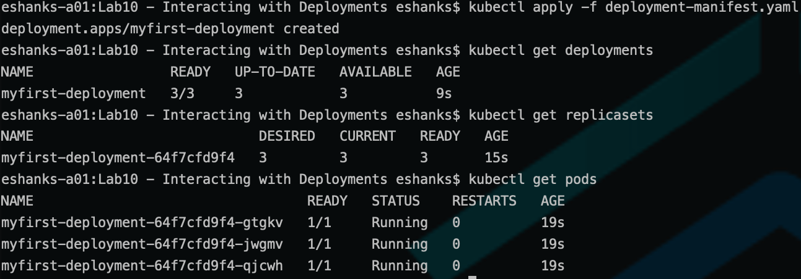
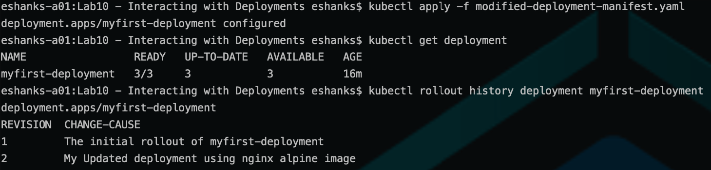
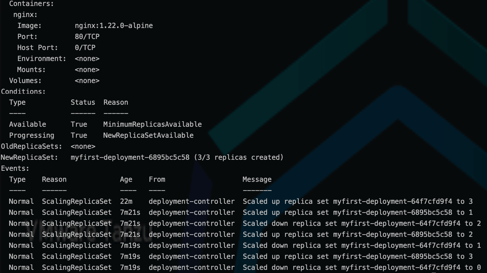
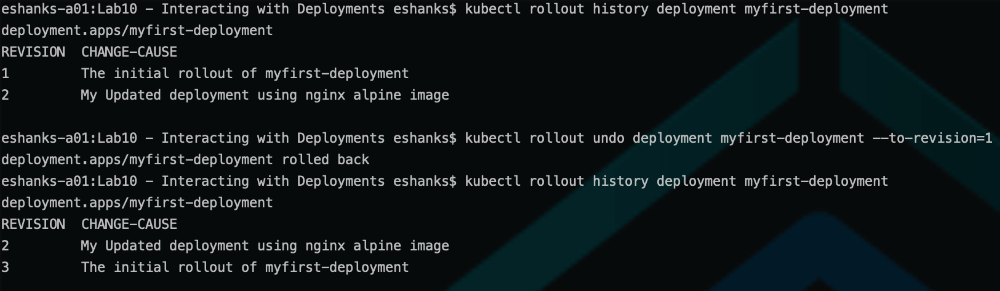

# Lab 10 - Interacting with Deployments

## Introduction

In this lab, you will deploy a Kubernetes deployment and perform a rollback operation.

### Step 1 - Authenticate to the TKG Service (if necessary)

The Authentication token stored in your local KUBECONFIG file expires every 10 hours. You will want to re-authenticate to the TKG Service before starting the lab to ensure you have access to the Supervisor cluster.

Run:

``` bash
kubectl vsphere login --server=[vSphere Control Plane Endpoint] --tanzu-kubernetes-cluster-namespace=poc --tanzu-kubernetes-cluster-name=alphacluster
```

After successful authentication, change your Kubernetes context to the alphacluster by running:

``` bash
kubectl config use-context alphacluster
```

>Note: See the [Authenticate](../../Chapter3/Authenticate%20to%20TKG/Instructions.md) lab for more a more detailed refresher on the procedures.

### Step 2 - Disable Pod Security Policies

Pod Security Policies (PSPs) are sometimes used to limit what access pods have within a Kubernetes cluster. For example, PSPs can be used to ensure Pods don't have sudo access within the Kubernetes nodes.

For this lab we will disable Pod Security Polices as they have been deprecated and we are not covering them in this course. Some versions of TKG have them enabled by default.

To Disable PSPs just apply the yaml from this lab's directory.

``` bash
kubectl apply -f disable-psp.yaml
```

### Step 3 - Deploy 3 nginx Pods as Part of a Deployment

Use the [deployment-manifest.yaml](./deployment-manifest.yaml) file supplied in this lab folder to create your first Kubernetes deployment.

``` bash
kubectl apply -f deployment-manifest.yaml
```

After the deployment has been successfully applied, review the objects created with the YAML manifest.

``` bash
kubectl get deployments
kubectl get replicasets
kubectl get pods
```



### Step 4 - Make a Change to the Deployment

Modify the deployment manifest to simulate a change to a running application. For this example we'll modify the nginx image used.

1. Modify the `kubernetes.io/change-cause:` annotation to give it a descriptive update name such as: `My Updated deployment using nginx alpine image`

2. Modify the container image to: `nginx:1.22.0-alpine`

> Note: There is a [Modified Deployment File](./modified-deployment-manifest.yaml) that can be used as a guide.

Apply the modified manifest to the cluster using:

``` bash
kubectl apply -f modified-deployment-manifest.yaml
```

### Step 5 - Review Changes to the Deployment

Once the deployment has been modified and applied, review the results.

``` bash
kubectl get deployment
kubectl rollout history deployment myfirst-deployment
```



Notice the revisions and their change-cause descriptions. How would you use this field to update your own applications in the future?

Describe the deployment to get further information about the events the deployment has gone through.

``` bash
kubectl describe deployment myfirst-deployment
```



Notice how the pods are scaled up and down during the rolling update of the deployment. If we wanted to replace two pods at once instead of one at a time, how could we accomplish this? What would we change in the modified deployment manifest to accomplish this?

### Step 6 - Rollback the Deployment

Rollback the modified deployment to the original version.

Review the revision history to decide which version to rollback to.

``` bash
kubectl rollout history deployment myfirst-deployment
```

Then choose the original deployment revision and rollback.

When complete check the rollout history again

``` bash
kubectl rollout history deployment myfirst-deployment
```



### Step 7 - Cleanup the Lab

When you're finished reviewing your pods, replica sets, and deployments delete the deployment.

``` bash
kubectl delete deployment myfirst-deployment
```

>Note: Leave the Pod Security Policies disabled (`from step 2`) for future labs.