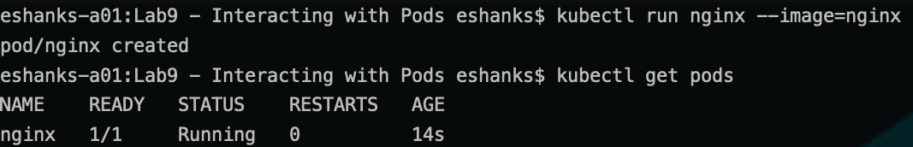
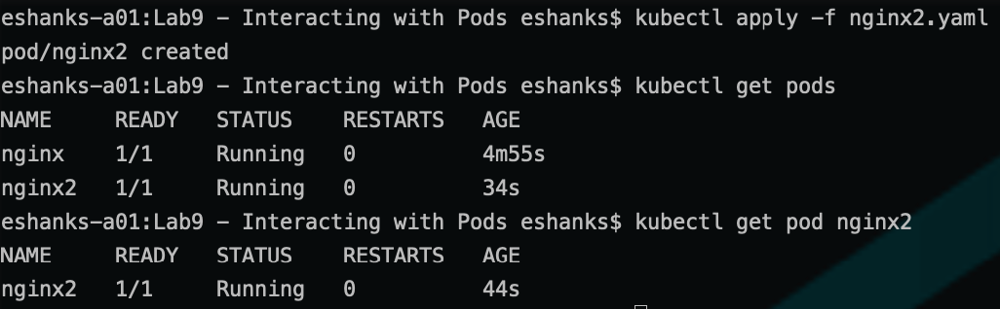
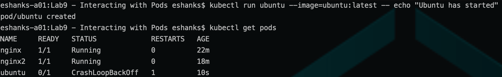
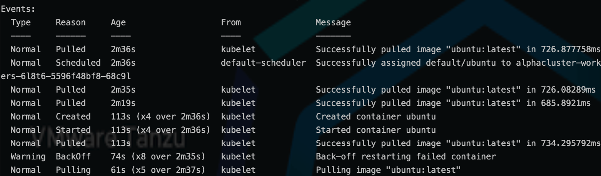
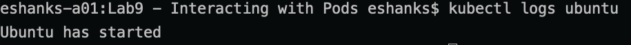
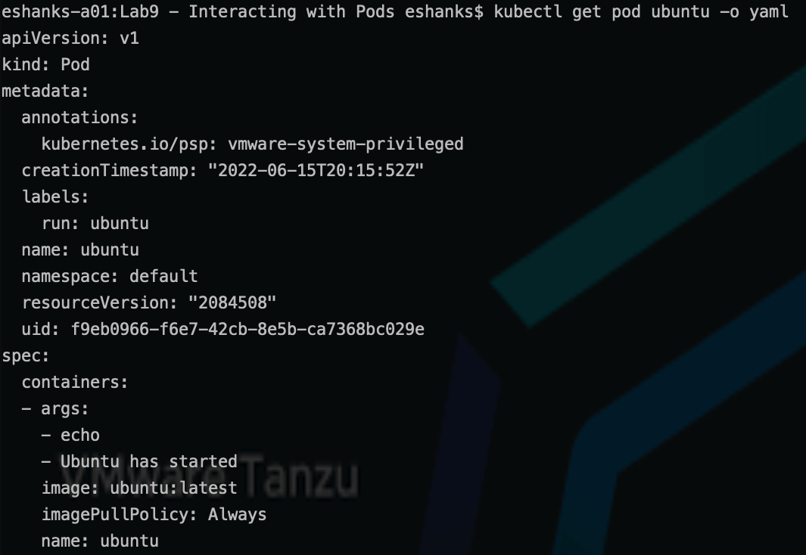
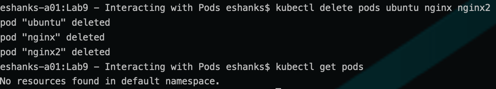

# Lab 9 - Interacting with Pods

## Introduction

In this lab, you will deploy some Kubernetes Pods and perform some lifecycle and troubleshooting operations to get familiar with the command line utilities.

### Step 1 - Authenticate to the TKG Service (if necessary)

The Authentication token stored in your local KUBECONFIG file expires every 10 hours. You will want to re-authenticate to the TKG Service before starting the lab to ensure you have access to the Supervisor cluster.

Run:

``` bash
kubectl vsphere login --server=[vSphere Control Plane Endpoint] --tanzu-kubernetes-cluster-namespace=poc --tanzu-kubernetes-cluster-name=alphacluster
```

After successful authentication, change your Kubernetes context to the alphacluster by running:

``` bash
kubectl config use-context alphacluster
```

>Note: See the [Authenticate](../../Chapter3/Authenticate%20to%20TKG/Instructions.md) lab for more a more detailed refresher on the procedures.

### Step 2 - Deploy a Pod with an Imperative Command

First run a pod with an imperative command by running:

``` bash
kubectl run nginx --image=nginx
```

When the command completes, check to see what pods are running by using the following command:

``` bash
kubectl get pods
```



### Step 3 - Deploy a Pod with a Declarative YAML file

Use the YAML file provided in this lab named `nginx2.yaml`

``` yaml
apiVersion: v1
kind: Pod
metadata:
  name: nginx2
spec:
  containers:
  - name: nginx
    image: nginx:1.22.0
    ports:
    - containerPort: 80
```

Apply the yaml file by running:

``` bash
kubectl apply -f nginx2.yaml
```

Check to see the status of the pods by running:

``` bash
kubectl get pods
```

The command should return the pod from step 2 and the pod from step 3. 

To limit your get request to the API server, you can specify the name of the pod such as:

``` bash
kubectl get pod nginx2
```



### Step 4 - Find Information about Deployed Pods

Deploy an ubuntu pod where it writes "Ubuntu has started!" to the stdout by running the imperative command:

``` bash
kubectl run ubuntu --image=ubuntu -- echo "Ubuntu has started!"
```

Check the status of the pod which should be starting, completing, and backing off before repeating the process.

``` bash
kubectl get pod ubuntu
```



Dig deeper by running a describe command to list the `Events` that have occurred when deploying the pod.

``` bash
kubectl describe pod ubuntu
```



Any stdout messages in a container can be queried through the Kubernetes API server by running the logs command. View any logs of the ubuntu container by running:

``` bash
kubectl logs ubuntu
```



"Why exactly did the log say, "Ubuntu is started!"? 

> hint: it comes from the command we used to start the container.

Sometimes you might want to get the YAML of a running container. You can do this by running:

``` bash
kubectl get pod ubuntu -o yaml
```

The result is that the API server returns the declarative YAML that can be used to build a new Kubernetes manifest if you like.



>Note: There are more fields in this YAML than we've covered in lectures.

### Step 5 - Clean Up

Delete the pods created during this lab by running:

``` bash
kubectl delete pods ubuntu nginx nginx2
```



### Step 6 - EXTRA CREDIT

For extra credit, deploy your own pod or use one from earlier in this lab.

Exec into the pod to perform some commands and then exit the container.

> Hint 1: `kubectl exec -it [podname] -- /bin/sh (or /bin/bash or other)

> Hint 2: To exit the container run `exit`

When done, delete the pod.

### Step 7 - EXTRA EXTRA CREDIT

Open a second terminal window and run:

``` bash
kubectl get pods --watch
```

Then in the other terminal window, deploy and delete some pods of your choosing.

What did you find in the terminal where the `--watch` command was running?

When you're finished, delete your pods and use Ctrl+c to exit the `--watch command`