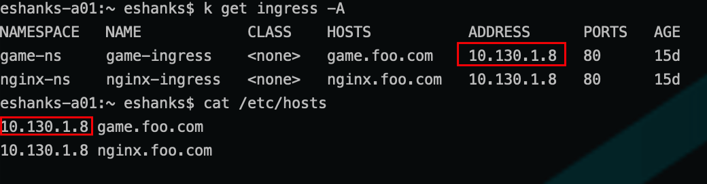
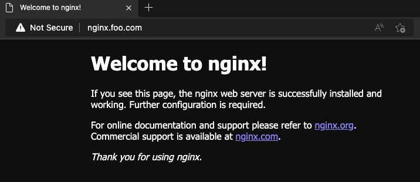

# Lab 13 - Working with Ingress

## Introduction

In this lab, you will deploy a Kubernetes service and use a test container to access the pods behind the service.

### Step 1 - Authenticate to the TKG Service (if necessary)

The Authentication token stored in your local KUBECONFIG file expires every 10 hours. You will want to re-authenticate to the TKG Service before starting the lab to ensure you have access to the Supervisor cluster.

Run:

``` bash
kubectl vsphere login --server=[vSphere Control Plane Endpoint] --tanzu-kubernetes-cluster-namespace=poc --tanzu-kubernetes-cluster-name=alphacluster
```

After successful authentication, change your Kubernetes context to the alphacluster by running:

``` bash
kubectl config use-context alphacluster
```

>Note: See the [Authenticate](../../Chapter3/Authenticate%20to%20TKG/Instructions.md) lab for more a more detailed refresher on the procedures.

### Step 2 - Deploy Contour

Contour can be deployed through Tanzu Kubernetes Grid extensions that are included with a TKG purchase. In this lab, we'll use the open source version from the [Contour quickstart](https://projectcontour.io/getting-started/]).

Deploy the Contour Ingress Controller, roles, services, and envoy proxies.

```bash
kubectl apply -f https://projectcontour.io/quickstart/contour.yaml
```

Wait for the components to install and check the resources deployed.

```bash
kubectl get all -n projectcontour
```

### Step 3 - Deploy Example Applications

Deploy a simple nginx container and deploy a game application.

Deploy the nginx containers

```yaml
---
apiVersion: v1
kind: Namespace
metadata:
  name: nginx-ns
---
apiVersion: v1
kind: Service
metadata:
  name: nginx
  namespace: nginx-ns
spec:
  selector:
    app: nginx
  ports:
    - protocol: TCP
      port: 80
      targetPort: 80
---
apiVersion: apps/v1
kind: Deployment
metadata:
  name: nginx-deployment
  namespace: nginx-ns
  labels:
    app: nginx
  annotations:
    kubernetes.io/change-cause: Initial Deployment
spec:
  strategy:
    type: RollingUpdate
    rollingUpdate:
      maxSurge: 1
      maxUnavailable: 1
  replicas: 3
  selector:
    matchLabels:
      app: nginx
  template:
    metadata:
      name: nginx
      labels:
        app: nginx
    spec:
      containers:
      - name: nginx
        image: nginx:1.21
        ports:
        - containerPort: 80
```

```bash
kubectl apply -f nginx.yaml
```

Deploy the game application

```yaml
---
apiVersion: v1
kind: Namespace
metadata:
  name: game-ns
---
apiVersion: v1
kind: Service
metadata:
  name: ourgame
  namespace: game-ns
spec:
  selector:
    app: game
  ports:
    - protocol: TCP
      port: 80
      targetPort: 80
---
apiVersion: apps/v1
kind: Deployment
metadata:
  name: game-deployment
  namespace: game-ns
  labels:
    app: game
  annotations:
    kubernetes.io/change-cause: Initial Deployment
spec:
  strategy:
    type: RollingUpdate
    rollingUpdate:
      maxSurge: 1
      maxUnavailable: 1
  replicas: 3
  selector:
    matchLabels:
      app: game
  template:
    metadata:
      name: game
      labels:
        app: game
    spec:
      containers:
      - name: game
        image: bsord/tetris
        ports:
        - containerPort: 80
```

```bash
kubectl apply -f game.yaml
```

> What namespace are the applications in?

> What type of service is used to expose these applications?

### Step 4 - Create Ingress Rules

Deploy rules that tell the Ingress Controller how you want the Envoy proxies to be configured. These rules define how traffic should be directed to services within the cluster.

```yaml
---
apiVersion: networking.k8s.io/v1
kind: Ingress
metadata:
  name: game-ingress
  namespace: game-ns
spec:
  rules:
  - host: game.foo.com
    http:
      paths:
      - pathType: Prefix
        path: /
        backend:
          service:
            name: ourgame
            port:
              number: 80
---
apiVersion: networking.k8s.io/v1
kind: Ingress
metadata:
  name: nginx-ingress
  namespace: nginx-ns
spec:
  rules:
  - host: nginx.foo.com
    http:
      paths:
      - pathType: Prefix
        path: /
        backend:
          service:
            name: nginx
            port:
              number: 80
```

```bash
kubectl apply -f ingress-rules.yaml
```

List the Ingress rules

```bash
kubectl get ingress -A
```

> What namespaces are the Ingress rules located within?

> What does the `-A` command do in the previous command?

### Step 5 - Access the Applications

Before you can access these applications, you must create DNS records for each application. This can be accomplished by either adding `A` records to your DNS servers, or by adding these records to your local hosts file.

You must map the DNS names `game.foo.com` and `nginx.foo.com` to the IP Address of the external load balancer.



Once DNS entries have been configured, open a web browser and navigate to:

http://nginx.foo.com



http://game.foo.com


### Step 6 - Cleanup the Lab

```bash
kubectl delete -f ingress-rules.yaml
kubectl delete -f nginx.yaml
kubectl delete -f game.yaml
```