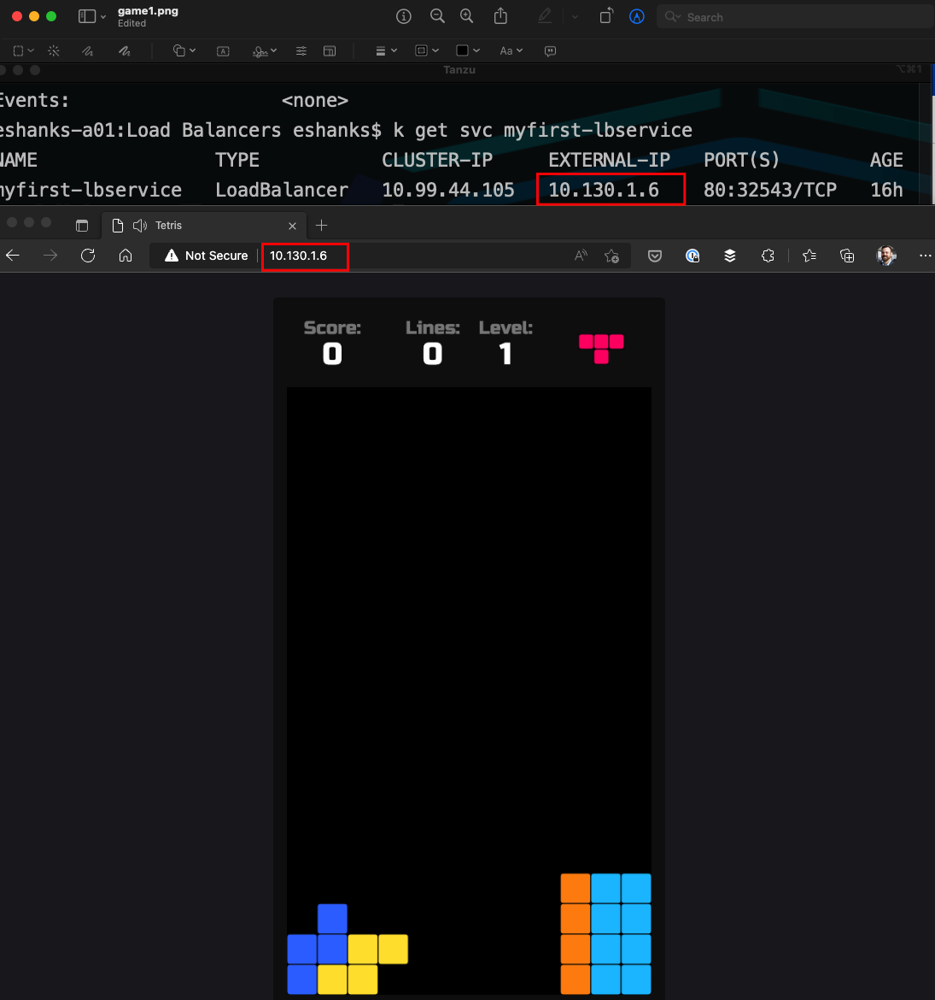

# Lab 12 - Load Balancer Services

## Introduction

In this lab, you will deploy a Kubernetes service and expose it outside of the Kubernetes cluster by using an external load balancer.

### Step 1 - Authenticate to the TKG Service (if necessary)

The Authentication token stored in your local KUBECONFIG file expires every 10 hours. You will want to re-authenticate to the TKG Service before starting the lab to ensure you have access to the Supervisor cluster.

Run:

``` bash
kubectl vsphere login --server=[vSphere Control Plane Endpoint] --tanzu-kubernetes-cluster-namespace=poc --tanzu-kubernetes-cluster-name=alphacluster
```

After successful authentication, change your Kubernetes context to the alphacluster by running:

``` bash
kubectl config use-context alphacluster
```

>Note: See the [Authenticate](../../Chapter3/Authenticate%20to%20TKG/Instructions.md) lab for more a more detailed refresher on the procedures.

### Step 2 - Deploy Pods and Services

Use a sample deployment and a Load Balancer Kubernetes service using the [supplied yaml](./lb-manifest.yaml) manifest.

``` yaml
apiVersion: v1
kind: Service
metadata:
  name: myfirst-lbservice
spec:
  selector:
    app: game
  ports:
    - protocol: TCP
      port: 80
      targetPort: 80
  type: LoadBalancer
---
apiVersion: apps/v1
kind: Deployment
metadata:
  name: game-deployment
  labels:
    app: game
  annotations:
    kubernetes.io/change-cause: Initial Deployment
spec:
  strategy:
    type: RollingUpdate
    rollingUpdate:
      maxSurge: 1
      maxUnavailable: 1
  replicas: 3
  selector:
    matchLabels:
      app: game
  template:
    metadata:
      name: game
      labels:
        app: game
    spec:
      containers:
      - name: game
        image: bsord/tetris
        ports:
        - containerPort: 80
```

Deploy the pods and services by running:

``` bash
kubectl apply -f lb-manifest.yaml
```

### Step 3 - Investigate the Service

1. List the service.

``` bash
kubectl get services -o wide
```

`Question:` What is the Cluster IP of the Service?
`Question:` What is the External IP of the Service?

2. Describe the Service

``` bash
kubectl describe service myfirst-service
```

`Question:` What port is the NodePort running on?

### Step 4 - Access the Application

Open a web browser and navigate to the external-IP address of the Load Balancer service.



Take a minute just to make sure the container is workign correctly, by playing for just a bit... not too long, there is work to do!

### Step 5 - Cleanup

Delete the deployments, replica sets, pods, and services.

``` bash
kubectl delete -f lb-manifest.yaml
```
