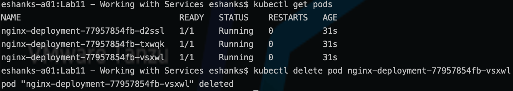
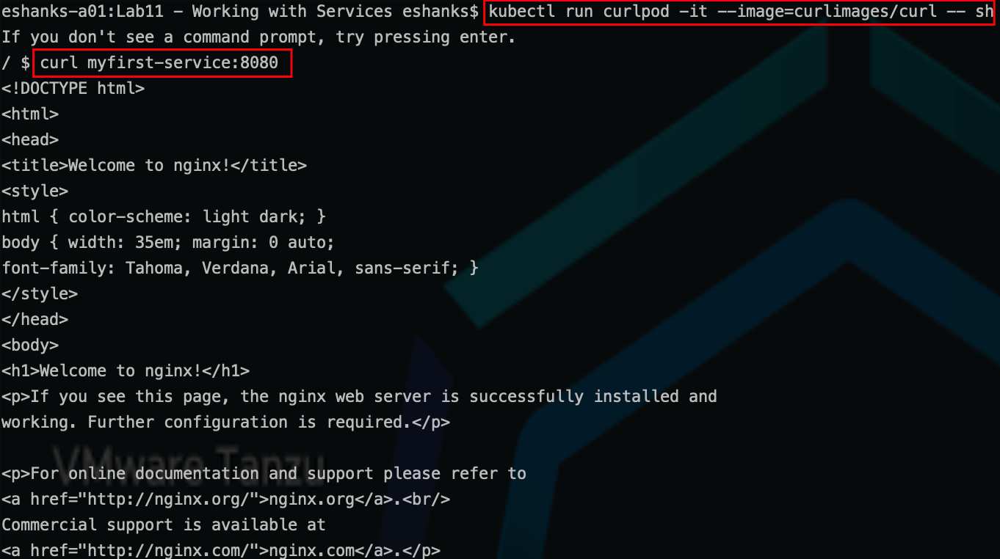

# Lab 11 - Working with Services

## Introduction

In this lab, you will deploy a Kubernetes service and use a test container to access the pods behind the service.

### Step 1 - Authenticate to the TKG Service (if necessary)

The Authentication token stored in your local KUBECONFIG file expires every 10 hours. You will want to re-authenticate to the TKG Service before starting the lab to ensure you have access to the Supervisor cluster.

Run:

``` bash
kubectl vsphere login --server=[vSphere Control Plane Endpoint] --tanzu-kubernetes-cluster-namespace=poc --tanzu-kubernetes-cluster-name=alphacluster
```

After successful authentication, change your Kubernetes context to the alphacluster by running:

``` bash
kubectl config use-context alphacluster
```

>Note: See the [Authenticate](../../Chapter3/Authenticate%20to%20TKG/Instructions.md) lab for more a more detailed refresher on the procedures.

### Step 2 - Deploy Pods and Services

Use an nginx deployment and a Kubernetes service using the [supplied yaml](./svc-manifest1.yaml) manifest.

``` yaml
---
apiVersion: v1
kind: Service
metadata:
  name: myfirst-service
spec:
  selector:
    app: app1
    tier: web
  ports:
    - protocol: TCP
      port: 8080
      targetPort: 80
---
apiVersion: apps/v1
kind: Deployment
metadata:
  name: nginx-deployment
  labels:
    app: app1
  annotations:
    kubernetes.io/change-cause: initial deployment
spec:
  strategy:
    type: RollingUpdate
    rollingUpdate:
      maxSurge: 1
      maxUnavailable: 1
  replicas: 3
  selector:
    matchLabels:
      app: app1
  template:
    metadata:
      name: nginx
      labels:
        app: app1
        tier: web
    spec:
      containers:
      - name: nginx
        image: nginx:1.22.0
        ports:
        - containerPort: 80
```

Deploy the pods and services by running:

``` bash
kubectl apply -f svc-manifest1.yaml
```

### Step 3 - Investigate the Service

1. List the service.

``` bash
kubectl get services -o wide
```

2. Describe the Service

``` bash
kubectl describe service myfirst-service
```

3. List the endpoints

``` bash
kubectl get endpoints  myfirst-service
```

4. Delete one of your pods

``` bash
kubectl get pods
kubectl delete pod [your_pod_name_here]
```



`Question:` How does deleting a pod affect the cluster?

- Did a new pod get created to replace that deleted pod?
- How did the endpoints change?
- How might this affect access from other applications?

### Step 4 - Curl the Nginx Welcome Page by Using the Service

Run a container that has the curl command installed in the image. As an example: use the following imperative command to deploy a curl container and exec into a shell.

``` bash
kubectl run curlpod -it --image=curlimages/curl -- sh
```

From the curl container run:

``` bash
curl myfirst-service:8080
```

You should receive the html for the nginx welcome page.



### Step 5 - Cleanup

Delete the deployments, replica sets, pods, and services.

``` bash
kubectl delete -f svc-manifest1.yaml
```
