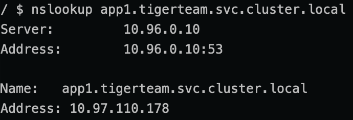
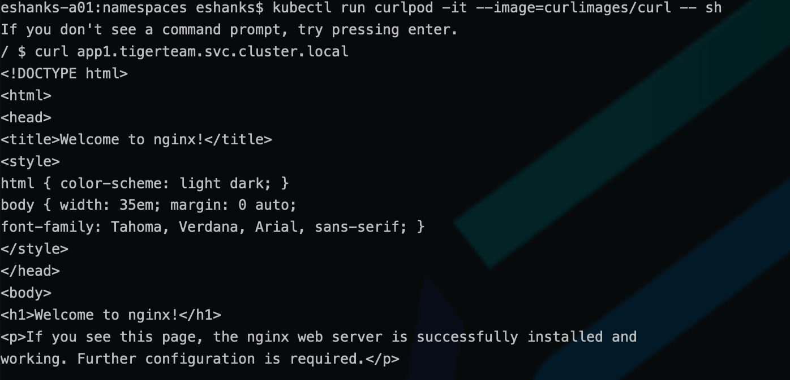

# Lab 13 - Namespaces and DNS

## Introduction

In this lab, you will create and interrogate resources in namespaces and view their DNS names.

### Step 1 - Authenticate to the TKG Service (if necessary)

The Authentication token stored in your local KUBECONFIG file expires every 10 hours. You will want to re-authenticate to the TKG Service before starting the lab to ensure you have access to the Supervisor cluster.

Run:

``` bash
kubectl vsphere login --server=[vSphere Control Plane Endpoint] --tanzu-kubernetes-cluster-namespace=poc --tanzu-kubernetes-cluster-name=alphacluster
```

After successful authentication, change your Kubernetes context to the alphacluster by running:

``` bash
kubectl config use-context alphacluster
```

>Note: See the [Authenticate](../../Chapter3/Authenticate%20to%20TKG/Instructions.md) lab for more a more detailed refresher on the procedures.

### Step 2 - Create a Kubernetes Namespace

Either use the imperative command:

``` bash
kubectl create namespace tigerteam
```

or 

apply the yaml file 

``` yaml
apiVersion: v1
kind: Namespace
metadata:
  name: tigerteam
```

Verify that the namespace was created successfully by running:

```bash
kubectl get ns
```

### Step 3 - Deploy Resources into the Namespace

Use the YAML file [found here](nginx-tigerteam.yaml) to deploy nginx pods and a service.

``` bash
kubectl apply -f nginx-tigerteam.yaml
```

Verify that the pods and services were deployed correctly.

``` bash
kubectl get pods -n tigerteam
kubectl get svc -n tigerteam
```

### Step 4 - Deploy a Utility Pod to test Name Resolution

From within the default namespace deploy a busybox pod and exec into the pod to a shell.

``` bash
kubectl run curlpod -it --image=curlimages/curl -- sh
```

Once you have a shell terminal see if you can resolve the app1 service.

``` bash
nslookup app1.tigerteam.svc.cluster.local
```



See what happens when you run nslookup without specifying the namespace. 

```bash
nslookup app1
```

Now see if you can curl the nginx service in the tigerteam namespace.

``` bash
kubectl run curlpod -it --image=curlimages/curl -- sh
```



Exit the utility pod shell by typing:

```bash
exit
```


### Step 5 - Cleanup the Lab

Delete the tigerteam pods and services.

``` bash
kubectl delete -f nginx-tigerteam.yaml
```

Delete the tigerteam namespace

``` bash
kubectl delete ns tigerteam
```

Delete the utility pod

``` bash
kubectl delete pod utility
```

### Challenge - Where is the Kubernetes Control Plane ???

Kubernetes clusters run many of the control plane components as containers. They may be hiding in one of the other namespaces. Can you find:

- The Kubernetes API Server
- The DNS Server
